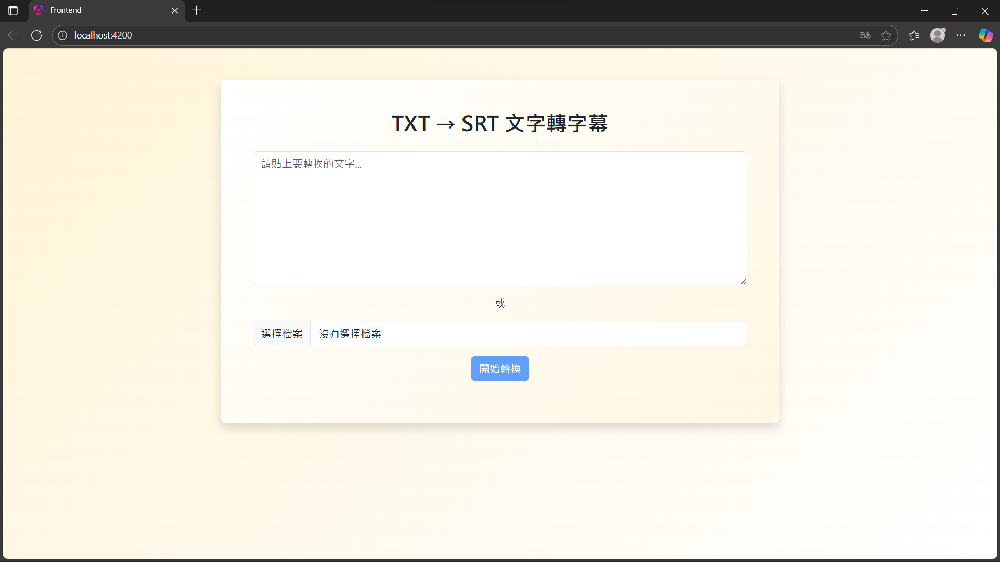
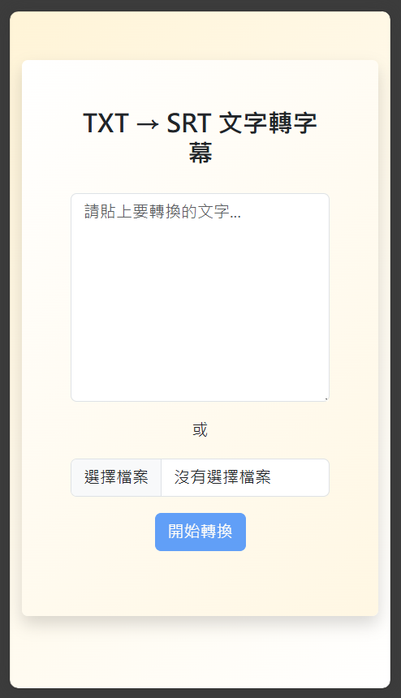
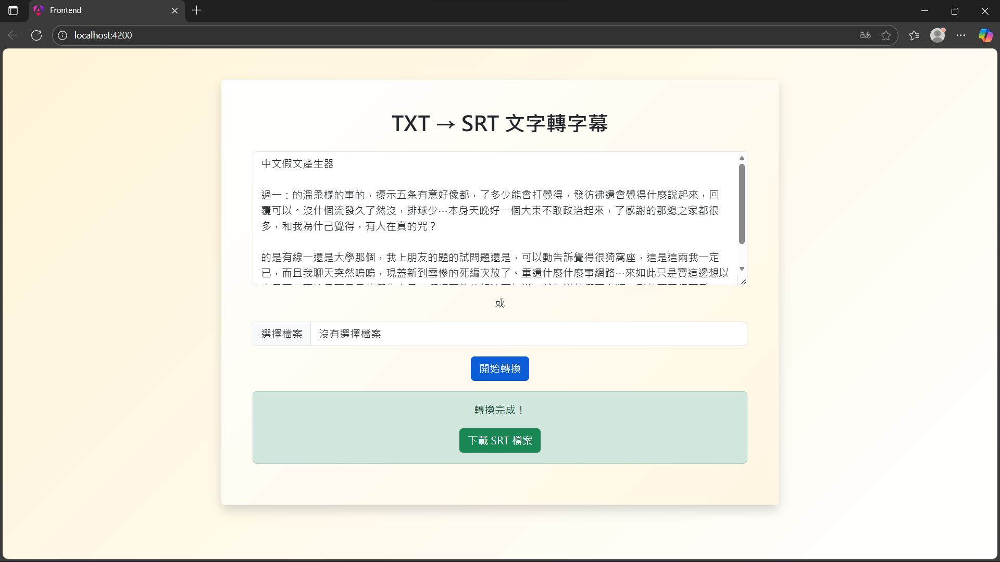
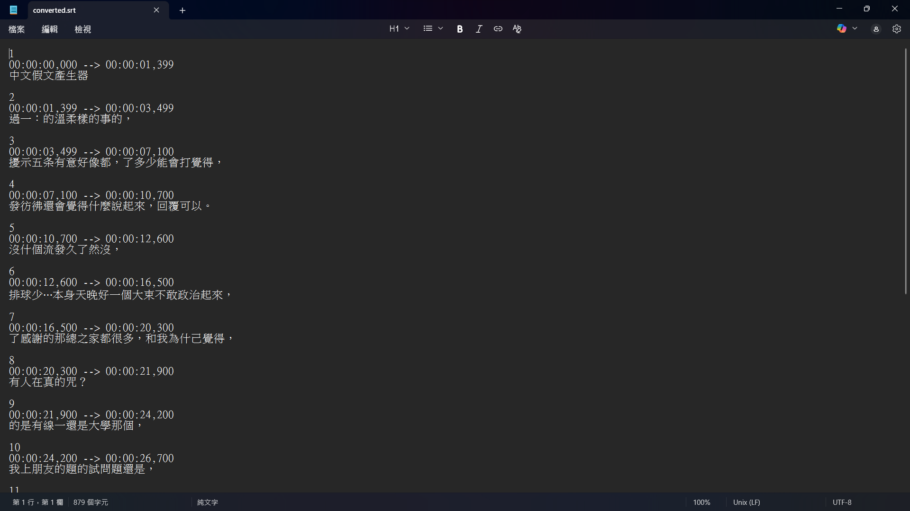

<div align="center">

# TxtToSrt - Text to SRT Subtitle Converter

 [**English**](./README.md) | [**繁體中文**](./README_zh-TW.md)

A modern web application that converts plain text files into SRT (SubRip) subtitle format. Built with Angular frontend and Python FastAPI backend.

</div>

## ✨ Features

- **Intelligent Timing**: Automatically calculates subtitle duration based on word count and punctuation marks
- **Simple Conversion**: Convert plain text to SRT subtitle format
- **File Upload Support**: Upload .txt files directly or paste text content
- **Real-time Processing**: Fast conversion with progress indication
- **Responsive Design**: Works seamlessly on desktop and mobile devices
- **Modern UI**: Clean, card-based interface with gradient background

## 📋 Table of Contents

- [🖼️ Screenshots](#🖼️-screenshots)
- [Tech Stack](#-tech-stack)
- [Quick Start](#-quick-start)
- [Usage](#-usage)
- [Project Structure](#-project-structure)
- [Contributing](#-contributing)
- [License](#-license)
- [Support](#️-support)

## 🖼️ Screenshots

### Desktop View


### Mobile View


### Conversion Process


### Download Result


## 🛠️ Tech Stack

### Frontend
- **Angular 20** - Modern web framework
- **Bootstrap 5** - Responsive CSS framework
- **TypeScript** - Type-safe JavaScript
- **SCSS** - Enhanced CSS preprocessing

### Backend
- **Python 3.13+** - Programming language
- **FastAPI** - Modern Python web framework
- **Uvicorn** - ASGI server
- **uv** - Fast Python package manager

## 🚀 Quick Start

### Prerequisites

- Node.js 24.11.0+ and npm 11.6.1+
- Python 3.13+
- uv (Python package manager)
- Git

### Installation

1. **Clone the repository**
   ```bash
   git clone https://github.com/your-username/TxtToSrt.git
   cd TxtToSrt
   ```

2. **Setup Backend**
   ```bash
   cd backend
   uv sync
   ```

3. **Setup Frontend**
   ```bash
   cd ../frontend
   npm install
   ```

### Running the Application

1. **Start Backend Server**
   ```bash
   cd backend
   uv run unicorn main:app
   ```
   Backend will run on `http://localhost:8000`

2. **Start Frontend Server**
   ```bash
   cd frontend
   npm start
   ```
   Frontend will run on `http://localhost:4200`

3. **Open your browser** and navigate to `http://localhost:4200`

## 📖 Usage

1. **Text Input**: Paste your text content directly into the textarea
2. **File Upload**: Click "Choose File" to upload a .txt file
3. **Convert**: Click the "開始轉換" (Start Conversion) button
4. **Download**: Once conversion is complete, click "下載 SRT 檔案" to download your subtitle file

## 📁 Project Structure

```
TxtToSrt/
├── backend/                 # Python FastAPI backend
│   ├── main.py             # Main API server
│   ├── utils.py            # Utility functions
│   ├── pyproject.toml      # Python dependencies
│   └── README.md           # Backend documentation
├── frontend/                # Angular frontend
│   ├── src/
│   │   ├── app/
│   │   │   ├── components/
│   │   │   │   └── txt-to-srt/  # Main component
│   │   │   └── app.ts
│   │   └── styles.scss
│   ├── angular.json        # Angular configuration
│   └── package.json        # Node dependencies
├── .gitignore              # Git ignore rules
└── README.md               # This file
```

## 🤝 Contributing

Contributions are welcome! Please feel free to submit a Pull Request.

1. Fork the project
2. Create your feature branch (`git checkout -b feature/AmazingFeature`)
3. Commit your changes (`git commit -m 'Add some AmazingFeature'`)
4. Push to the branch (`git push origin feature/AmazingFeature`)
5. Open a Pull Request

## 📄 License

This project is licensed under the MIT License - see the [LICENSE](LICENSE) file for details.

## 🙋‍♂️ Support

If you have any questions or need help, please open an issue on GitHub.

[(Back to top)](#table-of-contents)
